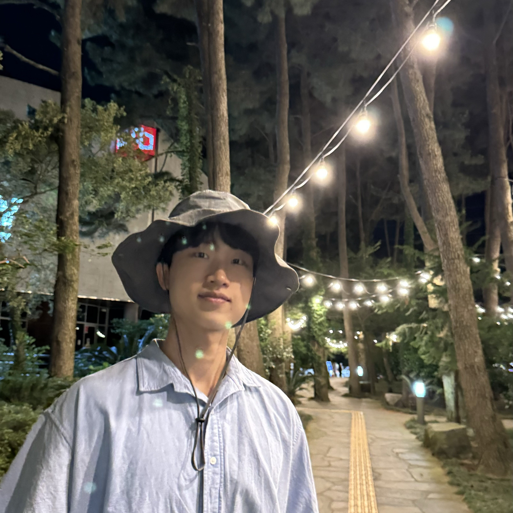

# Sangbum Lee
*Visual-Inertial SLAM Engineer*

[Website](https://sangbum99.github.io/) · [GitHub](https://github.com/Sangbum99) · [Email](mailto:leesab091435@gmail.com) · [Instagram](https://www.instagram.com/sang_bum_lee_) · [Notion Blog](https://www.notion.so/T2V-Text-to-Video-1cf48924374c80e98c4dcf23d453e314)

---

## About Me
I am a **Visual-Inertial SLAM** engineer from Korea with a strong passion for robotics 🤖. I am currently pursuing my master’s degree in the Navigation and Electronics System Lab (NESL) at Seoul National University. I specialize in designing probabilistic estimators using **C++**, **Python**, and **ROS** 👨🏻‍💻. While I have a few accepted papers, I take pride in developing my own code, which is available in my repositories. In addition to my SLAM work, I am capable of performing structural and aerodynamic analysis using CATIA and AutoCAD ⚙️.

I am always open to collaboration and happy to discuss any of my previous work. Please feel free to reach out with any questions 👏👏.

---

## Careers 🎓
- **Master Student in Aerospace Engineering** — *Seoul National University*  
  *Aug. 2023 – Present*

- **Undergraduate Research Assistant** — *Intelligent Rotorcraft Structure Lab., Konkuk University*  
  *Mar. 2023 – Aug. 2023*

- **International Exchange Student** — *Hamline University*  
  *Aug. 2022 – Jan. 2023*

- **B.S. in Mechanical and Aerospace Engineering** — *Konkuk University*  
  *Mar. 2018 – Aug. 2023*

---

## Accepted Papers 📃
- **GRVIO: Semantic-aware Visual-Inertial Odometry for Ground Robot Platforms**  
  *IEEE Access — under review*  
  *Sangbum Lee, Hanyeol Lee, and Chan Gook Park*

- **Visual-Inertial Odometry based on Dynamic Measurement Model**  
  *KSAS, Apr. 2025*  
  *Sangbum Lee, Hanyeol Lee, and Chan Gook Park*

- **G4Q-VIO: Ground constraints for a quadruped robot VIO**  
  *ICRA 40, Sep. 2024*  
  *Sangbum Lee, Hanyeol Lee, and Chan Gook Park*

- **Improvement of Visual-Inertial Odometry Utilizing Plane-Constraints for a Quadruped Robot**  
  *ICROS, Jul. 2024*  
  *Sangbum Lee, Hanyeol Lee, and Chan Gook Park*

- **Performance Enhancement Analysis of Mars Unmanned Helicopter Rotor**  
  *KSAS, Apr. 2023*  
  *Seong Hyun Hong, Sangbum Lee, Jae Seong Bae, Sung Nam Jung, et al.*

---

## Experience 🚀
### Research Member — Navigation and Electronics Lab. (NESL)  
*Sep. 2023 – Present*  
The Navigation and Electronics Lab (NESL) primarily focuses on researching integrated navigation systems, with recent expansions into SLAM (Simultaneous Localization and Mapping). Through my participation in a project with KARI, I contributed to the development of indoor and outdoor navigation technologies designed to perform effectively in unknown and challenging environments.  
My specialization lies in visual-inertial navigation systems. As highlighted in my accepted papers, I have focused on incorporating semantic information to improve the navigation accuracy of mobile platforms.

### H-Mobility: Autonomous Driving Course — Hyundai Motor Group  
*Mar. 2024 – Aug. 2024*  
This course covered the perception, control, and network systems of autonomous driving vehicles. Together with my teammates, I designed an integrated system using ROS 2 Humble and Python.  
For the implementation, YOLO-based instance segmentation and a bird’s-eye view transformation were employed to enable basic path planning and steering control. Signal communication was seamlessly managed through the DDS (Data Distribution Service) network architecture within ROS 2 Humble.

### Coursework (Selected)
- **Integrated Navigation System** — *A+* (Master, Seoul National University)  
- **Aerospace Estimation** — *A-* (Master, Seoul National University)  
- **System Engineering** — *A+* (Bachelor, Konkuk University)  
- **Control Engineering** — *A0* (Bachelor, Konkuk University)

---

## A Little More About Me
- Work out at the gym  
- Soccer  
- Gaming  
- Playing the guitar  

---

Favicon: `images/favicon.ico` · Theme: `sproogen/resume-theme` · Analytics not configured
